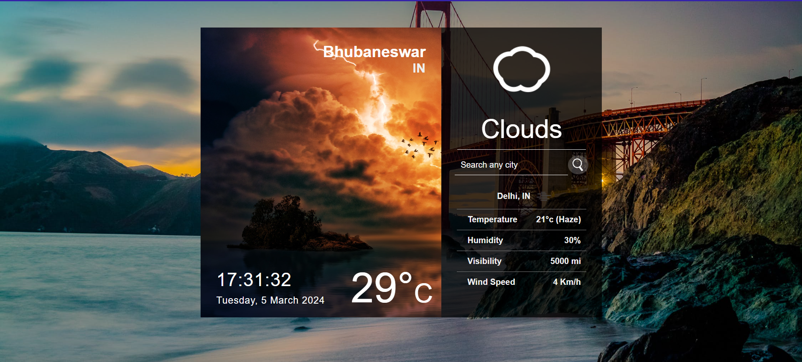
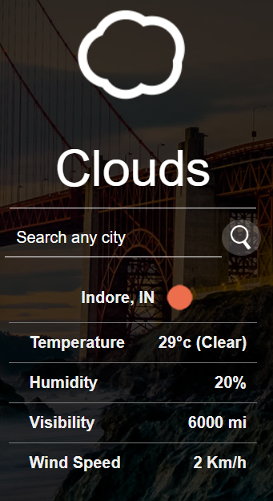
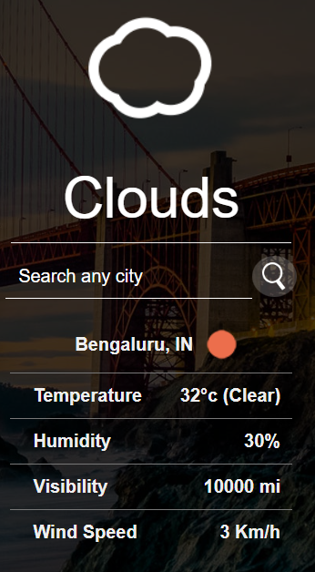

# Weather App
This full-stack project, built with React.js and leveraging a RESTful API, provides a visually stunning and responsive experience for staying informed about the weather.

Search for any city and access detailed information at your fingertips, always displayed beautifully on any device. Whether you're checking your local forecast or planning a trip, this app empowers you with the knowledge you need.

Embrace the clean and responsive design that delivers essential weather details like temperature, conditions, and more, all presented in an easily digestible format.

Head over to my Github repository to explore the code and experience the app for yourself!

## **Functionality**
1. This web app can access your current location and give the weather details with time.
2. Top of it, can access different cities across the world and provide information.
3. Beautiful & reactive interface which is optimised for multiple screen sizes.

## **Output**

 

### **Reactiveness**

